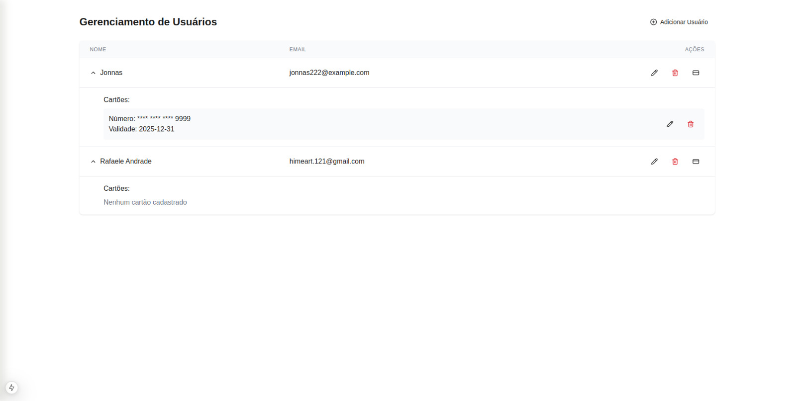

# Sistema de gerenciamento de clientes com cartões

Nesta API, foi implementado o Repository Pattern para abstrair a camada de acesso a dados e desacoplar a lógica de persistência da lógica de negócio.

Benefícios de usar Repository Pattern

- Desacoplamento: A lógica de acesso ao banco de dados foi encapsulada em repositórios, facilitando alterações na camada de persistência sem impactar a lógica de negócio.

- Reutilização: Os métodos do repositório são reutilizáveis em diferentes partes da aplicação.

- Testabilidade: A abstração proporcionada pelos repositórios permite a criação de mocks durante os testes unitários, tornando-os mais confiáveis.

- Organização do Código: Segregação clara entre responsabilidades, promovendo um código mais limpo e fácil de manter.

# API
- Acesse "backend_api" para começar as configurações para a API
- Copie o conteúdo em ".env.example" e cole em seu ".env", altere também o user e password do seu banco
- Atualize o composer com "composer update"
- Atualize também as depedẽncias, use "npm install"
- Agora inicie o servidor para ativar a API ela vai rodar na porta 8000

# FrontEnd
- Acesse o "frontend" para começar a configurar o front-end
- Utilize o "npm install" no terminal para instalar a dependência do projeto
- Utilize o "npm run dev" para iniciar a aplicação, estará rodando na porta 3000

# Rotas da aplicação para consumo da API
- Consultar usuários e cartões:
    Acesse a rota "127.0.0.1:8000/api/usuarios" no metódo GET para obter os usuários e cartões associados

- Criar usuário:
    Acesse a rota "127.0.0.1:8000/api/usuarios" no metódo POST para cadastrar o usuário, o json deve ter o formato
    {
        "nome": "Jonnas",
        "sobrenome": "Willian",
        "email": "jonnasnogueira2@gmail.com",
        "endereco": "Rua A, 123",
        "telefone": "123456789",
        "data_nascimento": "1999-04-01"
    }

- Editar usuário:
    Acesse a rota "127.0.0.1:8000/api/usuarios/{id}" no metódo PUT para atualizar o usuário, o json deve ter o formato
    {
        "nome": "Jonnas Willian",
        "sobrenome": "Ferreira",
        "email": "jonnasnogueira@gmail.com",
        "endereco": "Rua A, 123",
        "telefone": "123456789",
        "data_nascimento": "1999-04-01"
    }

- Apagar usuário:
    Acesse a rota "127.0.0.1:8000/api/usuarios/{id}" no metódo DELETE para apagar o usuário

- Consultar cartões:
    Acesse a rota "127.0.0.1:8000/api/cartoes" no metódo GET para obter os cartões cadastrados

- Criar cartão:
    Acesse a rota "127.0.0.1:8000/api/cartoes" no metódo POST para cadastrar um cartão, o json deve ter o formato
    {
        "numero": "1234567812345458",
        "data_validade": "2025-12-31",
        "cvv": "123",
        "usuario_id": "1"
    }

- Editar cartão:
    Acesse a rota "127.0.0.1:8000/api/cartoes/{id}" no metódo PUT para atualizar o cartão, o json deve ter o formato
    {
        "numero": "1234567812345458",
        "data_validade": "2025-12-31",
        "cvv": "113",
        "usuario_id": "1"
    }

- Apagar usuário:
    Acesse a rota "127.0.0.1:8000/api/cartoes/{id}" no metódo DELETE para apagar o cartão

# Teste automatizado
- Para realizar os testes acesse "backend_api" e utilize o comando "php artisan test", lembre de deixar o ".env.testing" com a mesma "APP_KEY" do ".env"